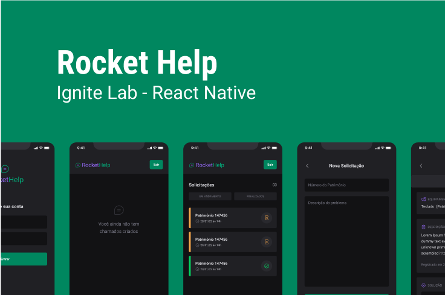

<p align="center">
  
</p>

<div align="center">
  

       

  
</div>

<h1 align="center">
    
</h1>

<br>

## 🧪 Technologies

This project was developed using the following technologies:

- [React Native](https://reactnative.dev/)
- [Expo](https://expo.io/)
- [NativeBase](https://nativebase.io)
- [Fireabse](https://firebase.google.com/?hl=pt)

## 🚀 Getting started

Clone the project and access the folder.

```bash
$ git clone https://github.com/jeffymesquita/rockethelp.git
```

Follow the steps below:
```bash
# Install the dependencies
$ yarn
# Start the project
$ expo run:android or expo run:ios
```

## 🔖 Layout

You can view the project layout through the links below:

- [Layout](https://www.figma.com/community/file/1130846653327904117/duplicate) 

Remembering that you need to have a [Figma](http://figma.com/) account to access it.

## 📝 License

This project is licensed under the MIT License. See the [LICENSE](LICENSE) file for details.

---

Made with :heartpulse: by [jeffymesquita](...) 👋
